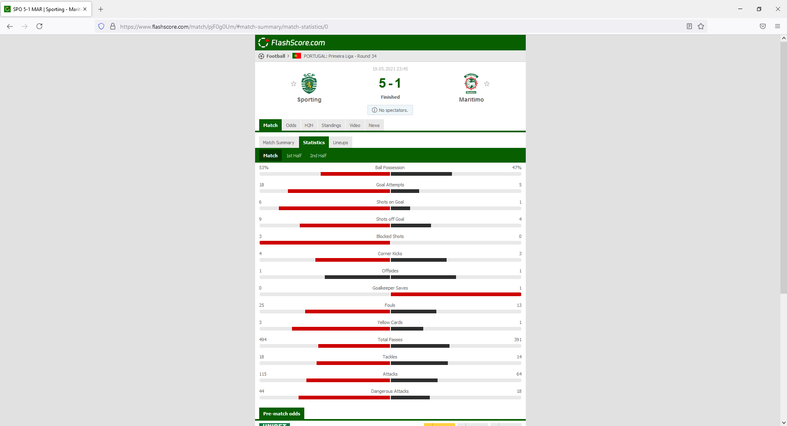
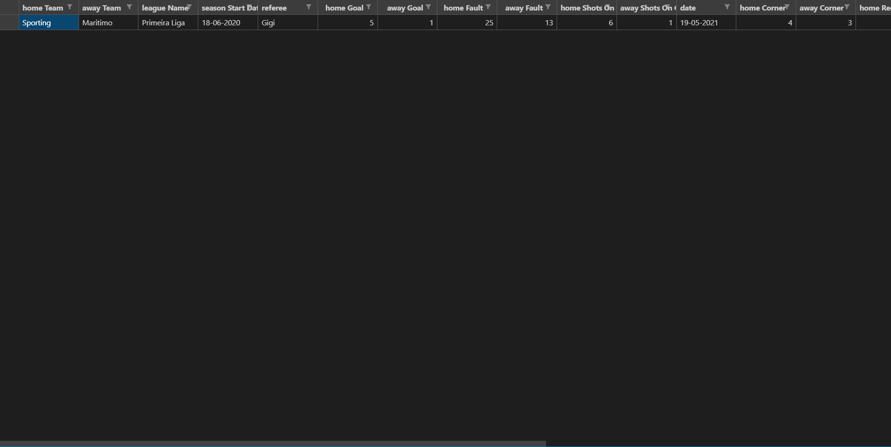
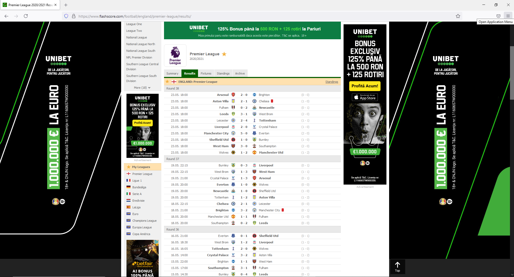
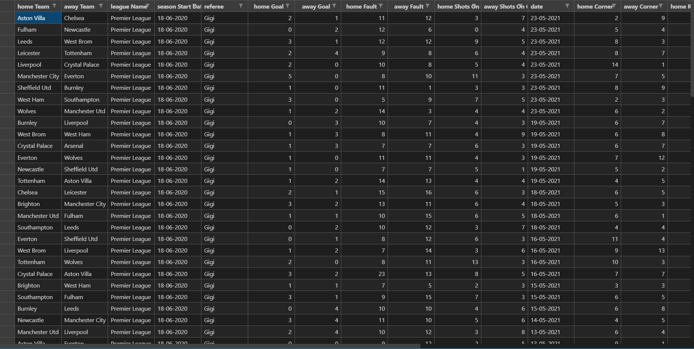

# Web Scraping FlashScore.com
:star: Star me on GitHub — it motivates me a lot!

WebScrapingFlashScore is a tool for scraping/gathering football match data. It checks every match
of a given league results link from flashscore.com, verifies the existing data with the data
that you need and copies all the requested information in a csv file.
You can scrape multiple matches or you can scrape a single match by a given link.
The script works automatically, all you need to do is change the link of a league if you want
to scrape multiple matches, with a link of a different league or you can change a single match
link if you desire to scrape a single match.

Single match scraping.

   
  

League matches scraping.

   
  

## How It Works
1. Install Beautiful Soup. [See here](https://subscription.packtpub.com/book/web_development/9781783289554/1/ch01lvl1sec08/installing-beautiful-soup#:~:text=Installing%20Beautiful%20Soup%20using%20setup.py,-We%20can%20install&text=Download%20the%20latest%20tarball%20from,(for%20example%2C%20BeautifulSoup%20).&text=cd%20BeautifulSoup%20python%20setup.py,Beautiful%20Soup%20in%20our%20system.)
   for more details.
2. Install Selenium. [See here](https://pypi.org/project/selenium/#:~:text=Python%20language%20bindings%20for%20Selenium,web%20browser%20interaction%20from%20Python.&text=Several%20browsers%2Fdrivers%20are%20supported,well%20as%20the%20Remote%20protocol.)
   for more details.
3. Get the compatible webdriver for your web browser. [See here](https://pypi.org/project/selenium/#:~:text=Python%20language%20bindings%20for%20Selenium,web%20browser%20interaction%20from%20Python.&text=Several%20browsers%2Fdrivers%20are%20supported,well%20as%20the%20Remote%20protocol.)
   for more details.
4. If you are trying to scrape a single match, in scrapeSinglePage.py
   replace the current link at line 7, with a link of another match.
   Also make sure to access the statistics tab in order to get the correct link.
5. In order to scrape all matches on the page of a league, in scrapeMultiplePages.py
   replace the current link at line 7, with a link of another league.
   Again, make sure to access the results tab in order to get the correct link.
